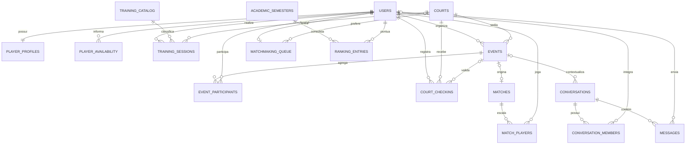

# Diagrama entidade-relacionamento — BASTREET

O diagrama representa o modelo PostgreSQL de referência definido em [`schema.sql`](./schema.sql). Ele é documentação evolutiva e não altera o armazenamento utilizado pela aplicação atual.

## Decisões estruturais

- A classificação técnica usada no balanceamento (`skill_rating`) é independente do ranking semestral.
- Disponibilidades, participantes, jogadores das partidas e membros de conversa são relações próprias, evitando listas embutidas.
- Treinos coletivos apontam para uma quadra e podem receber mais pontos de ranking sem misturar a regra com o histórico.
- Quadras aceitam dados de fontes externas, como OpenStreetMap, sem duplicação pelo par `external_source` e `external_id`.
- O esquema contém restrições e índices para integridade e desempenho, mas não armazena senhas em texto puro.
